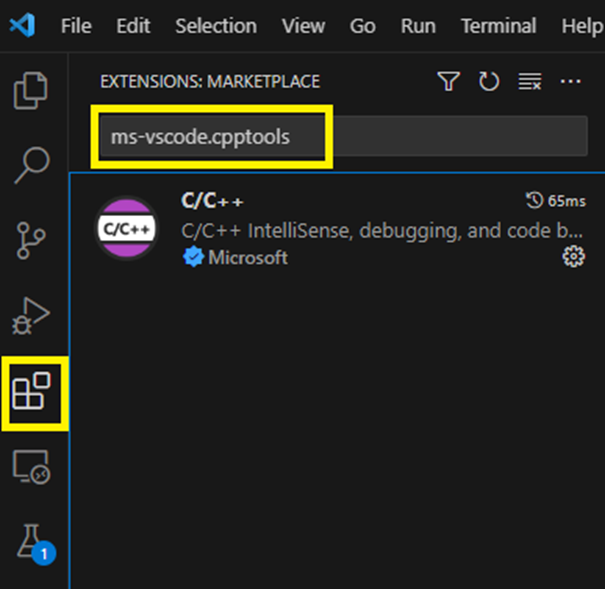
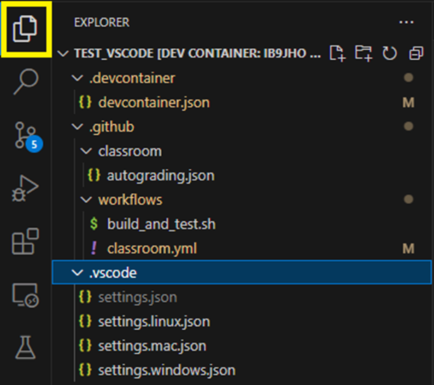

# Setting Up a Local IB9JHO Environment for C++ Programming

This is a guide to set up a local development environment with VSCode on your personal device for IB9JHO. 

## Windows Packages

1. **Open PowerShell in Administrator Mode**
   - Right-click on PowerShell and select "Run as administrator."

2. **Install Chocolatey Package Manager**
   - Copy the following command into PowerShell and press Enter:
     ```powershell
     Set-ExecutionPolicy Bypass -Scope Process -Force; [System.Net.ServicePointManager]::SecurityProtocol = [System.Net.ServicePointManager]::SecurityProtocol -bor 3072; iex ((New-Object System.Net.WebClient).DownloadString('https://community.chocolatey.org/install.ps1'))
     ```

3. **Install Required Packages**
   - In the terminal, run the following commands one by one:
     ```
     choco install git
     choco install visualstudio2022buildtools
     choco install visualstudio2022-workload-vctools
     choco install llvm
     choco install vscode
     choco install cmake
     choco install ninja
     ```

## macOS Packages

1. **Open Terminal**
2. **Install Homebrew Package Manager**
   - Copy the following command into the terminal and press Enter:
     ```bash
     /bin/bash -c "$(curl -fsSL https://raw.githubusercontent.com/Homebrew/install/HEAD/install.sh)"
     ```

3. **Install Required Packages**
   - In the terminal, run the following commands one by one:
     ```
     brew install git
     brew install llvm
     brew install --cask visual-studio-code
     brew install cmake
     brew install ninja

     ```

## VSCode Extensions

- Open VSCode and install the following extensions by opening the Extensions tab by searching for the extension name and clicking Install (see image below):
  - `ms-vscode.cpptools`
  - `ms-vscode.cpptools-extension-pack`
  - `ms-vscode.cmake-tools`
  - `twxs.cmake`
  - `brobeson.ctest-lab`
  - `github.vscode-github-actions`



## VSCode Settings

- For all IB9JHO repositories, the directory `.vscode` contains settings files for each operating system. You should copy the correct settings file for your operating system into a new file called `settings.json` (see image below).

- When you open any project in VSCode that contains a `CMakeLists.txt` file, it will ask if you want to configure it.
  You should always select the **clang compiler** (installed above) when prompted while you are working on IB9JHO. This ensures we are all using the same build tools.


